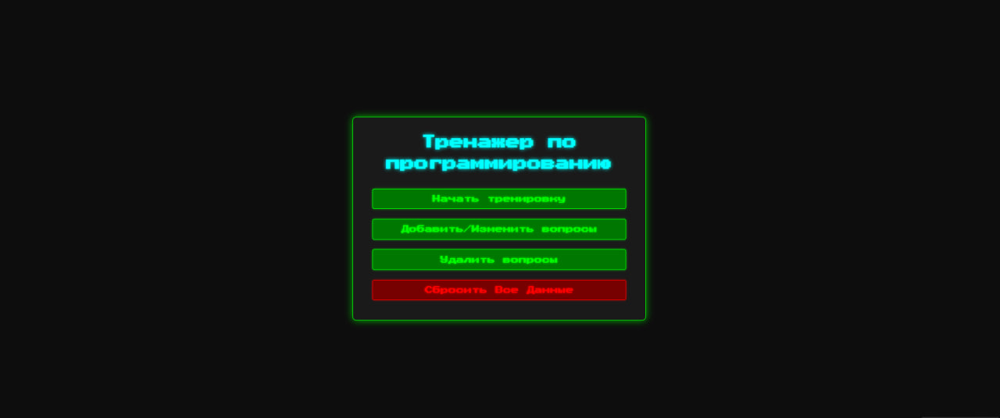

# Тренажер по Программированию

 ## Описание Проекта

Этот интерактивный тренажер создан для изучения и запоминания терминов и определений в области программирования. Он предлагает простой и эффективный способ проверить свои знания, добавлять собственные вопросы и отслеживать прогресс.

Приложение погружает вас в атмосферу **8-битного ретро-стиля**, который напоминает о золотой эре классических компьютерных игр и первых текстовых интерфейсов. С характерным ярко-зеленым текстом на темном фоне, эффектами свечения, пиксельными шрифтами (`Press Start 2P`) и мерцающими курсорами, а также тщательно подобранной **фоновой музыкой и звуковыми эффектами**, вдохновленными эпохой, вы почувствуете себя, как будто работаете на старом терминале из любимого научно-фантастического фильма 80-х или 90-х годов. Это путешествие в прошлое, где обучение становится частью ностальгического приключения, в стиле легендарной "Матрицы"!

screenshot2.jpg
**Иммерсивные видео- и звуковые эффекты** не только создают уникальную атмосферу, но и играют ключевую роль в процессе обучения. Они помогают сконцентрироваться, улучшают запоминание материала за счет ассоциаций и делают каждую сессию интерактивной и увлекательной, что способствует более быстрому и эффективному заучиванию программирования.

## Основные Возможности

* **Интерактивное тестирование:** Отвечайте на вопросы и получайте мгновенную обратную связь.
* **Режим тренировки:** Фокусируется на вопросах, которые вызывают затруднения, и повторяет их для лучшего запоминания.
* **Добавление/Изменение вопросов:**
    * Вручную добавляйте новые вопросы и ответы.
    * Редактируйте существующие вопросы.
    * **Импорт из Excel:** Загружайте списки вопросов и ответов из файлов `.xlsx` или `.xls` (вопросы в первом столбце, ответы во втором).
* **Удаление вопросов:** Легко управляйте списком вопросов, удаляя ненужные.
* **Статистика:** Отслеживайте свой прогресс: общее количество вопросов, отвеченных, правильных и с ошибками.
* **Безошибочные ответы подряд:** Мотивационный счетчик для отслеживания серий правильных ответов.
* **Визуальный стиль:** Эстетика "Матрицы" с динамической заставкой и звуковым сопровождением.
* **Сохранение данных:** Все добавленные вопросы и статистика сохраняются локально в браузере пользователя (используется LocalStorage).

## Как Использовать

1.  **Запустите приложение:** Откройте файл `index.html` в вашем веб-браузере.
2.  **Начните тренировку:** Нажмите кнопку "Начать тренировку" на главном экране.
3.  **Отвечайте на вопросы:** Введите свой ответ в текстовое поле и нажмите `Enter` или кнопку "Следующий вопрос".
4.  **Добавляйте свои вопросы:** Используйте кнопки "Добавить/Изменить вопросы" и "Удалить вопросы" в главном меню для управления базой вопросов.
5.  **Сброс данных:** Кнопка "Сбросить Все Данные" полностью очищает всю информацию (вопросы и статистику) из вашего браузера. Используйте с осторожностью!

## Структура Проекта

* `index.html`: Основная HTML-страница, структура приложения.
* `style.css`: Стилизация и оформление пользовательского интерфейса.
* `script.js`: Основная логика приложения, управление вопросами, статистикой, взаимодействием с пользователем.
* `menu_music.mp3`: Фоновая музыка для меню и модальных окон.
* `game_music.mp3`: Фоновая музыка для игрового процесса.
* `error.mp3`: Звук при неправильном ответе.
* `success.mp3`: Звук при правильном ответе.
* `coin.mp3`: Звук при переходе к следующему вопросу после завершения всех уникальных вопросов.

## Установка и Запуск (для локального использования)

1.  Клонируйте репозиторий:
    ```bash
    git clone [https://github.com/ВАШ_НИКНЕЙМ/имя-репозитория.git](https://github.com/alisher314/practix)
    ```

2.  Перейдите в папку проекта:
    ```bash
    cd practix
    ```
3.  Откройте файл `index.html` в вашем веб-браузере.

## Используемые Технологии

* HTML5
* CSS3
* JavaScript
* [canvas-confetti](https://www.npmjs.com/package/canvas-confetti) (для эффекта конфетти)
* [SheetJS (xlsx)](https://docs.sheetjs.com/) (для импорта из Excel)

## Автор

* **Алишер Абдурахманов**
    * [GitHub Профиль](https://github.com/alisher314)

---
